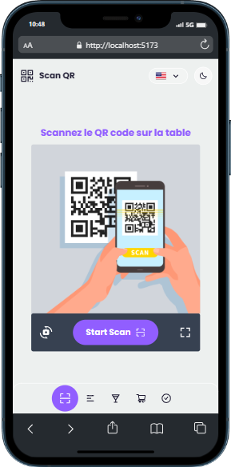

# QR Code Restaurant Ordering Application

This application allows restaurant customers to order and pay directly from their smartphone by simply scanning a QR code placed on the table. It offers a convenient, efficient, and contactless way to enhance the customer experience and order management.

## Overview

## Main Features

* **QR Code Scanning:** Customers scan a unique QR code at each table to access the menu and ordering platform.
[Image of Screenshot of the QR code restaurant ordering application]
* **Viewable Menu:** The restaurant's menu is displayed in a clear and intuitive manner, with photos and detailed descriptions of the dishes.
* **Ordering and Customization:** Customers can select dishes, quantities, and add options or special requests.
* **Integrated Payment:** The application supports payment by credit card or other mobile payment methods.
* **Order Confirmation and Tracking:** Customers receive an order confirmation and can track its status in real time.
* **Restaurant Side Management:** The restaurant staff can view incoming orders, prepare them, and mark them as completed.
* **Notifications:** Customers and staff receive notifications to inform them of new orders, status changes, and special requests.

## Sub Features

- Dark mode
- Multilingual support
- Email sending

## Prerequisites

- Node.js and npm installed on your machine

## Technologies Used

* **Frontend:** React JS
* **Backend:** Node.js
* **Database:** MongoDB
* **Payment Framework:** MyCoolPay

## Installation and Use

1. Clone this code repository on your machine
2. Open a terminal in the project folder and run the command `npm install` or `yarn` to install dependencies
3. Run the command `npm run dev` or `yarn dev` to launch the application in development mode
4. Open your browser and go to http://localhost:5173 to see the application in action

## Available Scripts

* `dev`: Launches the application in development mode using Vite.
* `build`: Compiles the JavaScript code and builds the application for production.
* `lint`: Runs ESLint to detect and correct errors in the TypeScript code.
* `preview`: Launches a preview version of the application using Vite.

To run a script, open a terminal and type `npm run script-name`, for example:

* `npm run dev` or `yarn dev` This will launch the application in development mode using Vite.
